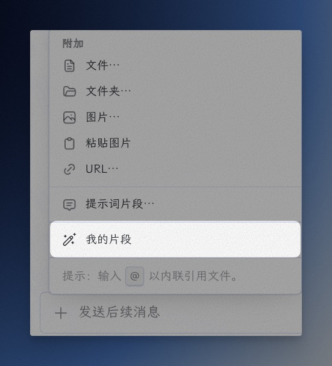
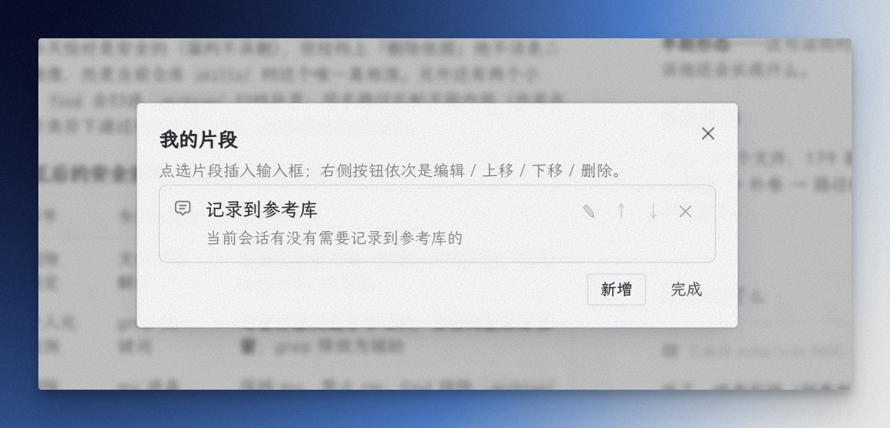
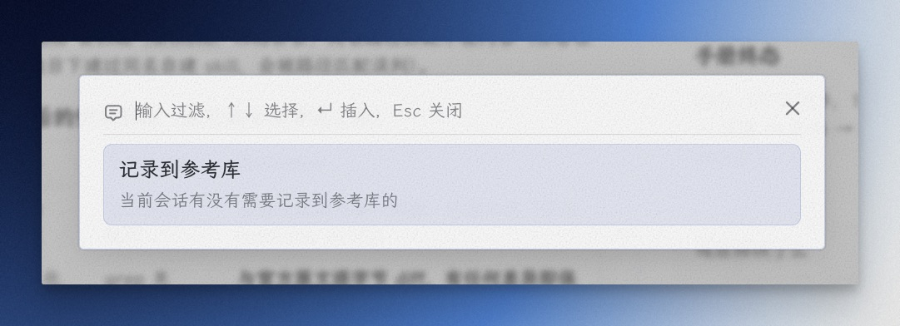

# Prompt Snippets — Hermes 桌面端自定义提示词片段 

Hermes Agent 桌面端插件：把你自己常用的提示词存成片段，一键插入聊天输入框。

官方自带的「提示词片段」是写死的三条（code review / implementation plan / explain this），无法自定义。这个插件补上了这一块——片段完全由你定义，并且给了两条使用路径：

| 入口 | 界面 | 用途 |
|---|---|---|
| 全局快捷键（自行绑定） | Cmd-K 式快速选择：打字过滤 → ↑↓ 选择 → ↵ 插入 | 日常快速插入，手不离键盘 |
| 输入框「+」菜单 / ⌘K「打开我的片段」 | 管理列表：新增 / 编辑 / 删除 / 上移 / 下移 | 维护片段库 |

## 特性

- **完全自定义**：名称 + 描述 + 片段内容，数量不限，随时排序
- **Cmd-K 式快速选择**：快捷键唤起，打字即过滤，全键盘操作
- **多会话精确路由**：多会话并排时，片段永远插入你当前操作的会话（按键盘焦点 / 最后点击的会话解析）
- **零构建、零后端**：单文件插件，落盘即装；数据存本地 localStorage，卸载即净

## 界面预览

**「+」菜单入口**——官方「提示词片段」下方多了一行「我的片段」：



**管理视图**——新增 / 编辑 / 删除 / 排序：



**快捷键快速选择**——Cmd-K 式：打字过滤 → ↑↓ 选择 → ↵ 插入：



## 安装

### 方式一：让 Hermes 帮你装（推荐）

把下面这段话直接发给 Hermes：

```
帮我安装这个桌面插件：https://github.com/Heybinshao/prompt-snippets
```

Hermes 会自动下载 `plugin.js` 放到正确位置（`~/.hermes/desktop-plugins/prompt-snippets/`）并完成加载。

### 方式二：手动安装

1. 确认安装了 [Hermes Agent](https://github.com/NousResearch/hermes-agent) 桌面端
2. 下载 `plugin.js`，放到 `~/.hermes/desktop-plugins/prompt-snippets/plugin.js`（目录不存在就创建）
3. 桌面端每 5 秒扫描该目录，落盘即自动加载（也可 ⌘K → **Reload desktop plugins**）

## 使用

1. **绑定快捷键**：Settings → 键盘快捷键，搜「打开我的片段」绑定（建议 ⌘/⌃ 系组合；alt 系在输入框内会被官方按键系统忽略）
2. **添加片段**：输入框「+」菜单 →「我的片段」→「新增」，填名称和内容（描述可选）
3. **快速插入**：按快捷键 → 打字过滤 → ↵ 插入当前会话输入框
4. **管理**：「+」菜单 →「我的片段」，每行右侧依次是 编辑 / 上移 / 下移 / 删除

## 数据

- 存储：浏览器 localStorage，key `hermes.plugin.prompt-snippets.snippets-v1`
- 导出/迁移：DevTools Console 执行 `localStorage.getItem('hermes.plugin.prompt-snippets.snippets-v1')` 复制 JSON
- 停用：Settings → Plugins 关掉 Prompt Snippets（数据保留）
- 卸载：删除插件目录

## 技术说明

- 插入走 Hermes 官方 `hermes:composer-insert` 事件总线，由弹窗实例所在的 composer surface 解析路由，多会话并排时精确投递
- 界面完全使用官方 SDK 组件（Dialog / Button / Input / Textarea），跟随应用主题与语言
- 插件重载（热重载 / 停用）时自动清理全部状态与监听器，无残留

## 关于作者

**彬少** —— 一个什么都折腾一下的人：装系统 · 玩AI · 搭知识库 · 做设计。这个插件是我在日常用 Hermes 时，为了把自己常用的提示词一键插进对话而写的，现在就挂在我的输入框左侧。

微信公众号 **「宝藏彬少」**：折腾，是为了更好用。欢迎关注交流。

## LICENSE

[MIT](./LICENSE)
